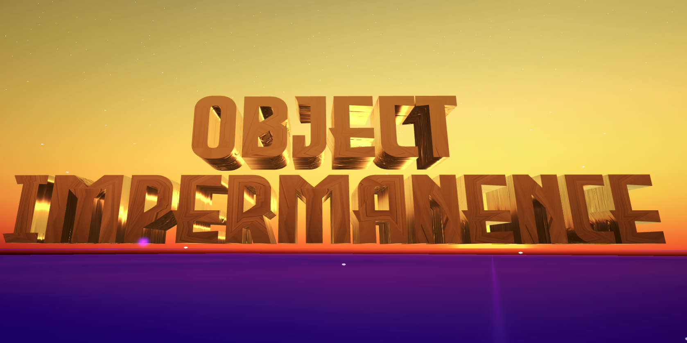

# Object Impermanence

## Description
Object Impermanence is a VR dungeon crawler utilizing Non-Euclidean Geometry tricks and puzzles. You explore a dungeon full of mysterious and weird artifacts which you can sell to buy weapons and tools. But beware there are creatures that lurk in the dark. In order to leave the dungeon alive you’ll have to find the final boss and defeat him.

## Credits
- **Developer:** Kyle Gann
- **Artist and Co-Developer:** Charlie Major

## About
Object Impermanence was created as a Unity project for an Exploring VR Worlds class at the University of Nebraska-Lincoln.

## Features
- **Immersive VR Experience:** Dive into a virtual world filled with mystery and danger, brought to life through VR.
- **Non-Euclidean Geometry:** Explore environments that defy traditional geometric rules.
- **Artifact Collection:** Discover a variety of mysterious artifacts scattered throughout the dungeon, each holding its own secrets and potential rewards.
- **Trading System:** Exchange found artifacts for valuable weapons and tools to enhance your chances of escaping.
- **Enemies:** Face off against menacing creatures that lurk in the darkness, ready to strike at any moment.
- **Boss Battle:** Confront a powerful boss as you strive to overcome the ultimate challenge and escape the dungeon.

## Installation
Download at this link [Itch.io](https://whitefangalive.itch.io/object-impermanence)

or

1. Clone the repository to your local machine.
2. Open the project in Unity.
3. Build and run the project in your VR device.

## Feedback
We welcome any feedback or suggestions you may have. Feel free to reach out to us with your thoughts on how we can improve Object Impermanence.

Enjoy your adventure in Object Impermanence!
